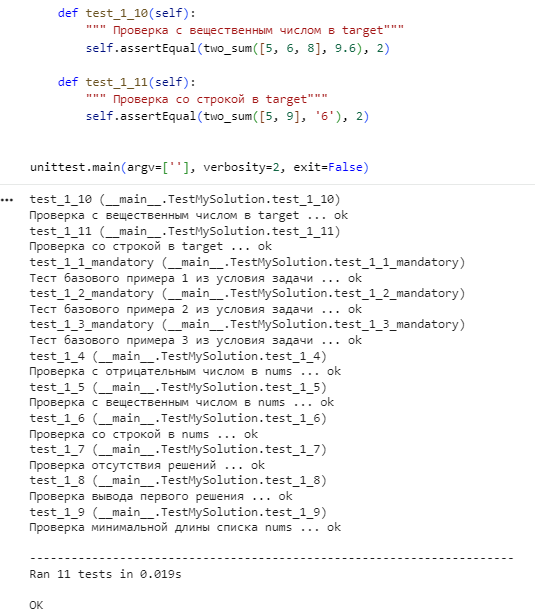

# Лабораторная работа №1

### Overview
* **Дата:** 19.09.25
* **Тема:** Алгоритм поиска двух чисел с заданной суммой (Two Sum)
* **Статус:** [Completed]

---

### Objective
Разработать отказоустойчивую функцию `two_sum`, которая находит индексы двух элементов в списке, чья сумма равна заданному числу `target`. Необходимо обеспечить строгую валидацию входных данных и успешно пройти набор юнит-тестов.

### Implementation
1. **Валидация данных:** В функции реализованы проверки на минимальную длину списка (не менее 2 элементов) и проверку типов данных элементов списка и целевого значения. Если данные некорректны, функция возвращает код ошибки `2`.
2. **Алгоритм поиска:** Использован метод «грубой силы» (Brute Force) с двумя вложенными циклами.
3. **Обработка результатов:** Если пара найдена, возвращается список из двух индексов. Если нет — `None`.
4. **Тестирование:** Код был протестирован по 11 сценариям. Все тесты пройдены успешно (`OK`).

### Code
```python
def two_sum(nums, target):
    """
    Находит два индекса чисел в списке, которые дают в сумме target
    """
    # Проверка входных данных
    if len(nums) < 2:
        return 2

    # Проверка, что все элементы - целые числа
    for num in nums:
        if not isinstance(num, int):
            return 2

    # Проверка, что target - целое число
    if not isinstance(target, int):
        return 2

    for i in range(len(nums)):
        for j in range(i + 1, len(nums)):
            if nums[i] + nums[j] == target:
                return [i, j]
    return None

# Пример использования
nums = [2, 7, 11, 15]
target = 9
print(two_sum(nums, target))

