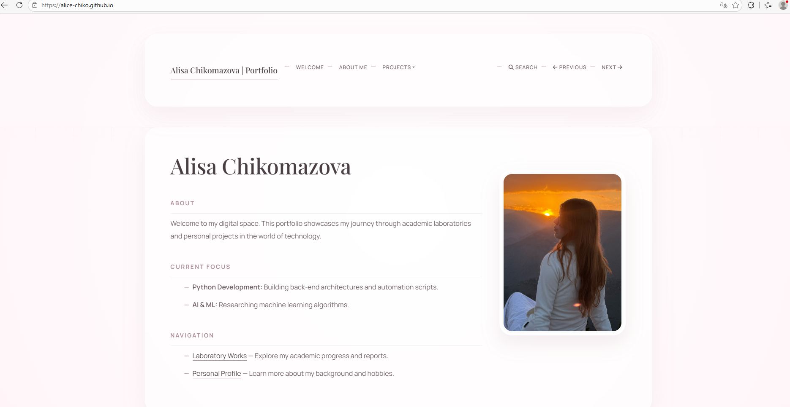
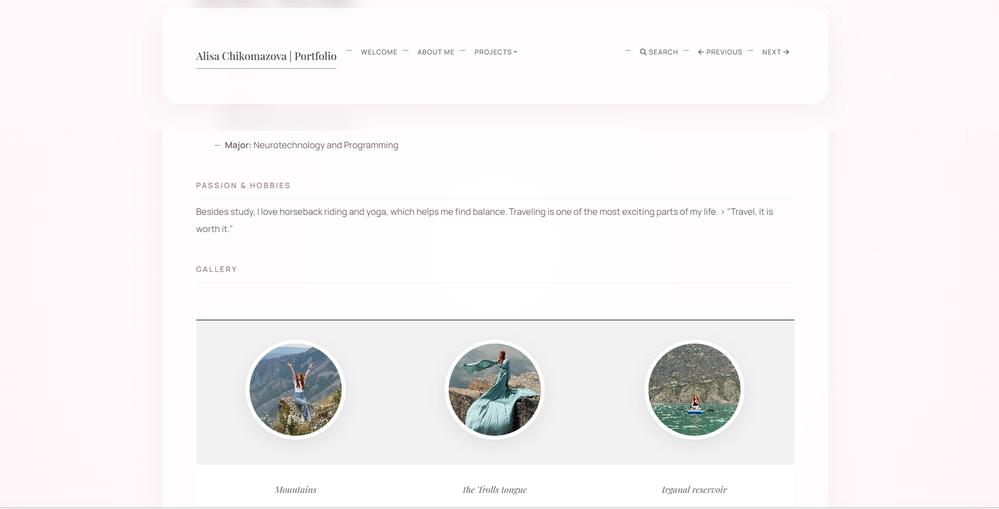
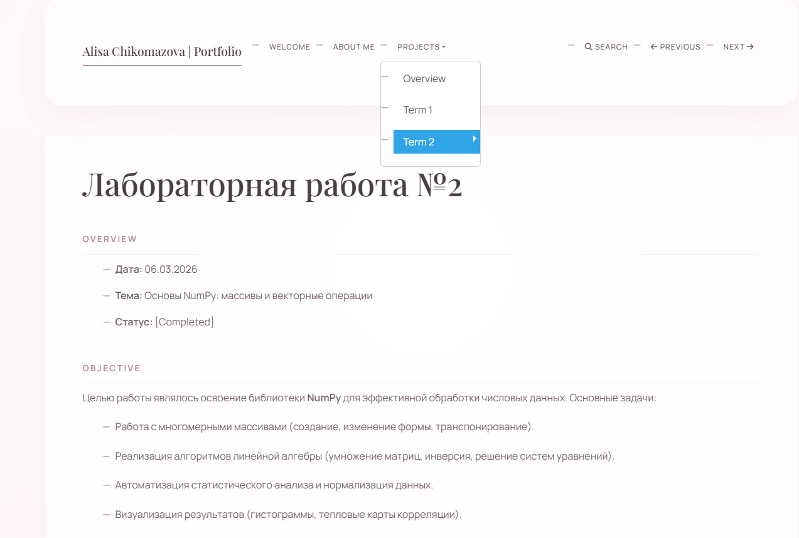

# Лабораторная работа №1

### Overview
* **Дата:** 14.02.2026
* **Тема:** Создание и развертывание статического сайта на базе MkDocs с публикацией на GitHub Pages
* **Статус:** [Completed]

---

### Objective
Освоить процесс создания статического сайта с использованием генератора документации MkDocs, организовать структуру портфолио и развернуть сайт на платформе GitHub Pages на личном домене

### Implementation
В ходе выполнения работы были выполнены следующие шаги:

1. Настройка окружения: Создано виртуальное окружение Python (venv) и установлен пакет mkdocs.
2. Структурирование проекта: Исходные файлы (Markdown, конфигурации) вынесены в папку source, а сборка настроена в корневую папку docs для корректной работы GitHub Pages.
3. Конфигурация: Настроен файл mkdocs.yml, подключена кастомная тема оформления и создана навигация через параметр nav.
4. Стилизация: Добавлен файл extra.css для настройки визуального оформления сайта.

### Conclusion
В результате работы был успешно запущен статический сайт-портфолио. Я научилась работать с генераторами статики, управлять структурой проекта через YAML-конфигурации и автоматизировать публикацию через GitHub Pages.

### Visualisation

