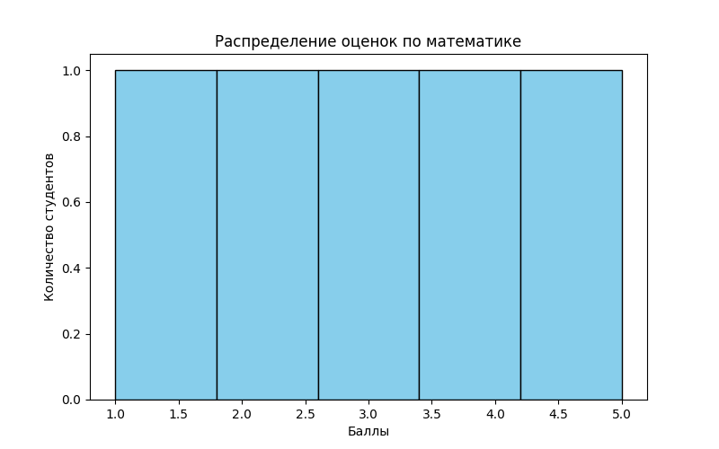
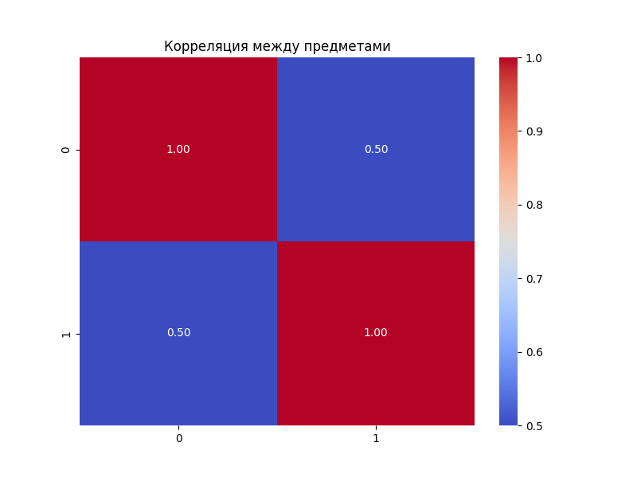
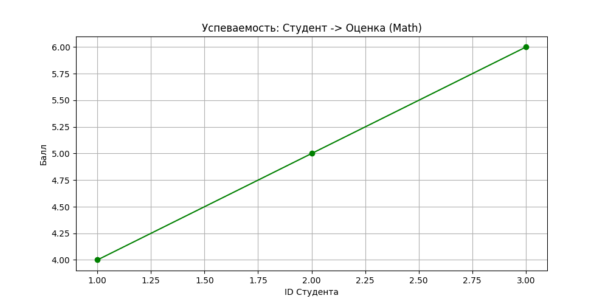
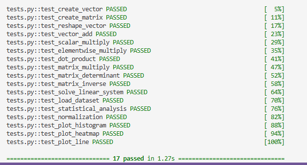

# Лабораторная работа №2

### Overview
* **Дата:** 06.03.2026
* **Тема:** Основы NumPy: массивы и векторные операции
* **Статус:** [Completed]

---

### Objective
Целью работы являлось освоение библиотеки **NumPy** для эффективной обработки числовых данных. Основные задачи:

* Работа с многомерными массивами (создание, изменение формы, транспонирование).

* Реализация алгоритмов линейной алгебры (умножение матриц, инверсия, решение систем уравнений).

* Автоматизация статистического анализа и нормализация данных.

* Визуализация результатов (гистограммы, тепловые карты корреляции).

### Implementation
Задача решена с применением стандартов **DAST/DATS**:

1.  **Тесты:** Реализовано 17 юнит-тестов (`pytest`), проверяющих корректность математических операций.

2.  **Аннотации:** Весь код аннотирован согласно PEP 484 

3.  **Спецификация:** Соблюден стандарт PEP 8 (оформление кода, отступы, импорты).

**Технические нюансы:**

* **Векторизация:** Вместо циклов `for` использованы векторные операции NumPy, что на порядки ускоряет вычисления.

* **Стабильность:** В функцию нормализации добавлена проверка на деление на ноль (в случае, если все оценки в выборке одинаковы).

### Conclusion
* Реализована библиотека необходимых функций для работы с данными.
* Все 17 тестов пройдены успешно (`100% PASSED`).
* Сгенерированы и сохранены визуализации распределения успеваемости и корреляционных связей между предметами в папку `plots/`.

### Visualisation
В ходе работы были сгенерированы графики, отражающие распределение данных и зависимости между ними. Все графики сохранены в директорию проекта.

**Гистограмма распределения оценок:**
Показывает частоту встречаемости определенных баллов в учебной группе.

**Тепловая карта корреляции:**
Визуализирует взаимосвязь между оценками по разным предметам.

**Линейный график успеваемости:**
Отображает динамику оценок в зависимости от номера студента в списке.

**Результаты тестирования:**
Скриншот успешного прохождения всех 17 юнит-тестов.

### Run the project
1. Активируйте окружение: `source numpy_env/bin/activate` (или `Scripts\activate` на Windows)
2. Запустите тесты: `python -m pytest tests.py -v`
3. Сгенерируйте отчет: `python main.py`

