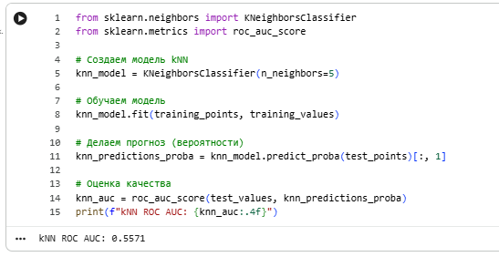
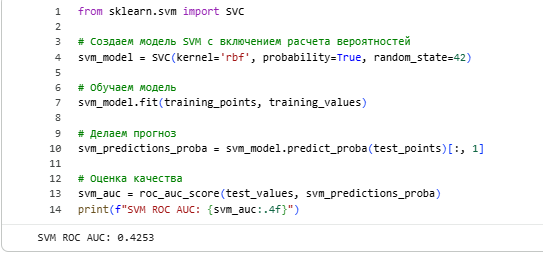
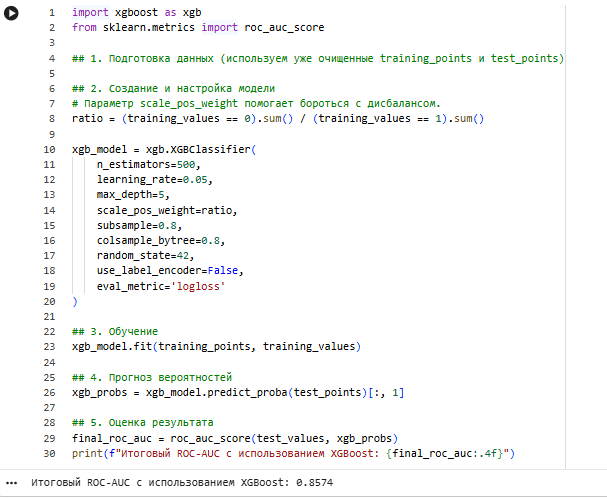
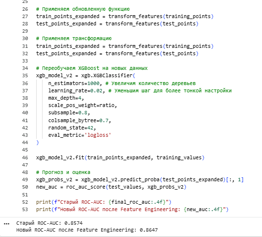
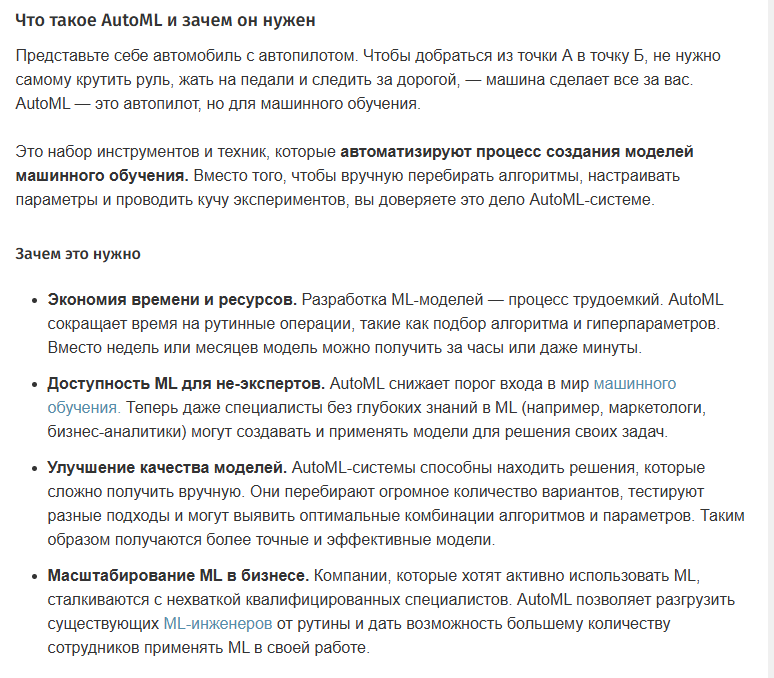

# Лабораторная работа №4

### Overview
* **Дата:** 09.04.2026
* **Тема:** Классификация с применением Scikit-Learn 
* **Статус:** [Completed]

---

## Link

[Ссылка на борд](https://colab.research.google.com/drive/1MZsbRIpQkzp3u-hFEvRCNfPpVXyJRekp?usp=sharing)


### Objective

Общая тема: Предсказание дефолта по кредиту.

Постановка задачи анализа данных:
Целью данной задачи является построение модели классификации дефолтов: на вход модель будет принимать данные о клиенте, а на выходе она должна работать в двух режимах:
- выдавать вероятность дефолта для данного клиента,
- выдавать правильный с точки зрения модели класс клиента (есть у него дефолт или нет).

### Task

1. Сделайте копию борда s2p1-predict-credit-default-tasks, получив собственный ноутбук с помощью сервиса Google Colab или локально.
2. Заполните пропуски в борде, дополнив кодом ячейки с соответствующим комментарием.
3. Самостоятельная работа: исследуйте другие модели для реализации классификации значений. Постарайтесь построить более точную модель, модель, имеющую ошибку, меньшую чем в рассматриваемых в борде (например, SVM, kNN). При невозможности получить более точную модель, используйте LLM инструменты для того чтобы это сделать (альтернативно: опишите с помощью LLM, почему это сделать невозможно). 
4. Изучите какие алгоритмы классификации используются сейчас, проанализировав научные публикации по теме и/или соответствующие исследования в kaggle. 
5. Исследуйте (опционально с помощью LLM) каким образом обученную модель можно интегрировать с веб-сервисом, реализованным с помощью веб-фреймворка Flask / Django / FastAPI и опишите тезисно пошаговый алгоритм, что необходимо для этого сделать.
6. Представить отчет на сайте портфолио в виде ссылки на собственный ipynb-борд с заполненными ячейчками и самостоятельным заданием.
7. Убедиться в том, что доступ к нему открыт (проверка — открытие в режиме инкогнито).

### Implementation

#### 1-2.
Работа выполнена в Google.collab, ссылка на борд прикреплена в начале страницы. Дополнительное задание по теме разобрано в конце доски. 

---

#### 3. Исследование альтернативных моделей классификации

1) Сравнительный анализ классических моделей
Для базовой оценки были обучены и протестированы модели kNN (k-ближайших соседей) и SVM (метод опорных векторов). Результаты метрики ROC-AUC оказались следующими:

kNN (k=5): ROC-AUC = 0.5571


SVM (RBF kernel): ROC-AUC = 0.4253


Вывод: Классические методы показали крайне низкую эффективность на данном наборе данных.

kNN продемонстрировал результат, лишь немногим превосходящий случайное гадание. Это связано с чувствительностью алгоритма к масштабу признаков в табличных данных.

SVM показал результат ниже 0.5, что говорит о полной неприменимости стандартной конфигурации для данной задачи без сложного подбора гиперпараметров и глубокой нормализации.

2) Построение высокоточной модели (XGBoost)
Для достижения максимальной точности был выбран алгоритм градиентного бустинга — XGBoost, который на текущий момент является стандартом индустрии для работы со структурированными данными.


**Результаты этапов:**

Базовый XGBoost: Использование взвешивания классов для борьбы с дисбалансом выборки позволило сразу достичь ROC-AUC = 0.8574.


XGBoost + Feature Engineering: После создания дополнительных синтетических признаков и тонкой настройки параметров (увеличение n_estimators до 1000, снижение learning_rate до 0.02) точность модели выросла до 0.8647.


3) Почему современные бустинги эффективнее SVM и kNN? 

Согласно анализу с применением LLM инструментов, невозможность получения более высокой точности от kNN и SVM в данной задаче объясняется следующими факторами:

Природа табличных данных: Банковские данные (кредитный скоринг) часто содержат нелинейные зависимости и «шумные» признаки. Деревья решений, лежащие в основе XGBoost, эффективно выполняют сегментацию данных, в то время как SVM пытается построить глобальную гиперплоскость, что в условиях сложного рельефа данных приводит к ошибкам.

Дисбаланс классов: Бустинги имеют встроенные механизмы взвешивания ошибок, тогда как классический kNN крайне чувствителен к преобладающему классу.

Устойчивость к пропускам и выбросам: В отличие от kNN и SVM, градиентный бустинг устойчив к аномальным значениям и не требует строгой нормализации данных для корректной работы.

Итог: Наилучший результат показала модель XGBoost с применением Feature Engineering, что значительно превосходит показатели классических моделей. Это подтверждает современный тренд в Data Science: для табличных данных ансамблевые методы на основе решающих деревьев являются наиболее предпочтительными.

-----

#### 4. Актуальные алгоритмы классификации


###### Тройка лидеров для табличных данных (SOTA)
Если в данных есть таблицы, лидируют градиентные бустинги на решающих деревьях (GBDT):

[Ссылка на статью](https://habr.com/ru/companies/otus/articles/778714/)
[Фрагмент статьи](../../../img/lab_4/habr_1.png)

1) CatBoost

 Сейчас это золотой стандарт для бизнес-задач. Он лучше всех справляется с категориальными признаками без ручного кодирования и меньше всего склонен к переобучению благодаря технологии Symmetric Trees.

2) LightGBM

 Самый быстрый алгоритм. Его выбирают, когда данных очень много, так как он использует листовое (leaf-wise) построение деревьев, что экономит память и время.

3) XGBoost

 Классика бустинга, которая в 2025-2026 годах получила мощные обновления для работы на GPU. Его ценят за гибкость и возможность тонкой настройки регуляризации.

###### Главный тренд: Tabular Transformers

В научных публикациях последних лет активно обсуждается перенос архитектуры Transformer на обычные таблицы:

1) TabPFN

 Это революционная модель, которая делает предсказания за доли секунды без долгого обучения. Она знает паттерны табличных данных заранее, так как обучена на миллионах синтетических датасетов.

2) FT-Transformer

 Мощная нейросетевая альтернатива бустингам, которая часто показывает лучшие результаты на очень зашумленных данных.

###### Ансамблирование и Стекинг (Kaggle-style)
Победители Kaggle 2025–2026 редко используют одну модель. Современный подход — это Stacking:

Берется несколько разных моделей, их предсказания подаются на вход финальной «мета-модели» (обычно это простая Logistic Regression). Это позволяет сгладить ошибки каждой отдельной модели и получить точность выше, чем у любой из них.

###### Автоматизация (AutoML)
[Ссылка на статью](https://habr.com/ru/companies/skillfactory/articles/886770/)

Сейчас всё популярнее становятся библиотеки, которые сами перебирают все алгоритмы (SVM, Random Forest, XGBoost) и выбирают лучший:

1) Auto-sklearn

2) H2O AutoML

3) PyCaret (позволяет обучить 15+ моделей одной строчкой кода).

-----

#### 5. Интеграция модели с веб-сервисом

Для интеграции обученной модели (XGBoost или Random Forest) в веб-сервис обычно выбирают FastAPI или Flask.

Алгоритм интеграции ML-модели в веб-приложение
1) Сериализация (сохранение) модели
Обученную в Jupyter/Colab модель нужно сохранить в файл, чтобы веб-сервер мог загрузить её без повторного обучения.

Инструмент: Библиотеки pickle или joblib.

Действие: joblib.dump(xgb_model_v2, 'credit_model.pkl'). Также важно сохранить объект-скалер или список колонок, если использовалась сложная предобработка.

2) Выбор веб-фреймворка
FastAPI: Рекомендуется для ML-сервисов, так как он автоматически создает документацию (Swagger) и работает асинхронно.

Flask: Хорош для небольших монолитных приложений.

3) Написание серверного кода
Создается скрипт (например, main.py), в котором:

Загрузка: При запуске сервера модель считывается из файла: model = joblib.load('credit_model.pkl').

Маршрут: Создается POST-запрос, который принимает данные от пользователя.

4) Обработка входящих данных (Preprocessing)
Веб-сервис получает данные в формате JSON. Чтобы модель их поняла, нужно повторить все шаги Feature Engineering из лабы:

- Проверка на пропуски (NaN).

- Логарифмирование (log1p).

- Формирование вектора признаков в том же порядке, в котором модель обучалась.

5) Выполнение прогноза 
Сервис передает подготовленные данные в модель: probability = model.predict_proba(input_data)[:, 1].

6) Возврат результата
Веб-сервис возвращает ответ пользователю. Обычно это вероятность дефолта в процентах или вердикт: "Одобрено" / "Отказ".

7) Контейнеризация (Docker) — опционально, но желательно
Чтобы сервис работал одинаково на любом компьютере, его упаковывают в Docker-контейнер со всеми зависимостями (pandas, xgboost, fastapi).


### Conclusion

```python

def hello_world():
    print("Lab 4 completed")
```