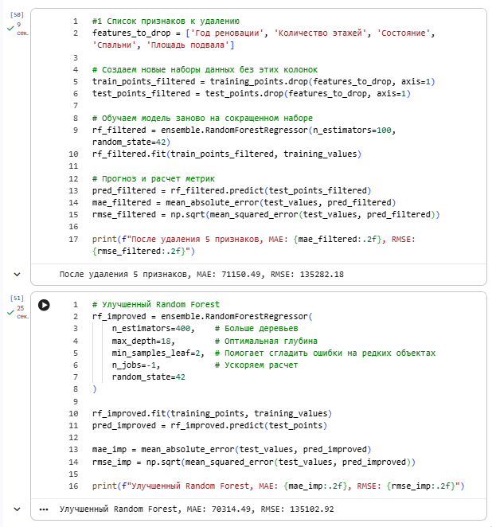
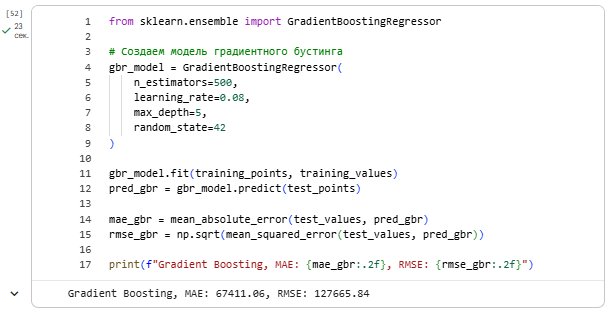

# Лабораторная работа №5

### Overview
* **Дата:** 09.04.2026 
* **Тема:** Регрессия с применением Scikit-Learn 
* **Статус:** [Completed]

---

## Link

[Ссылка на борд](https://colab.research.google.com/drive/1-bwoPunrKtHHms0OLHqmAYTu32GNZukB?usp=sharing)


### Objective

Общая тема: Предсказание цен на недвижимость.

Постановка задачи анализа данных:
Целью данной задачи является прогнозирование стоимости домов в округе Кинг с помощью построения регрессионных моделей и их анализа. 

### Task
1. Сделайте копии заданий s1p1-predict_house_price-tasks.ipynb, получив собственный ноутбук с помощью сервиса Google Colab или локально.
2. Заполните пропуски в борде, дополнив кодом ячейки с соответствующим комментарием/заголовком.
3. Выполните самостоятельную работу, предложенную в конце борда: в частности, исследуйте другие модели для реализации предсказания значений. Постарайтесь построить более точную модель, модель, имеющую ошибку, меньшую чем при использовании моделей, используемых в борде.
4. Исследуйте параметры модели Random Forest и постарайтесь получить ещё более низкое (чем в текущей реализации) значение ошибки для этой модели.
5. Исследуйте (возможно с помощью LLM) каким образом обученную модель можно интегрировать с веб-сервисом, реализованным с помощью веб-фреймворка Flask / Django / FastAPI и опишите тезисно пошаговый алгоритм, что необходимо для этого сделать.
6. Представить отчет на сайте портфолио и указать ссылку на сайт (на самом сайте - указать ссылку на собственный ipynb-борд с заполненными ячейчками и самостоятельным заданием.)
7. Убедиться в том, что доступ к нему открыт.

### Implementation

#### 1-2.
Работа выполнена в Google.collab, ссылка на борд прикреплена в начале страницы. Дополнительное задание по теме разобрано в конце доски. 

---

#### 3-4. Исследование альтернативных моделей для реализации предсказания значений

1) Оптимизация параметров модели Random Forest

Улучшение базовой модели Случайного Леса реализовано путем исследования гиперпараметров, удалось добиться снижения ошибок MAE и RMSE.

Для этого было:

- Увеличено количество деревьев (n_estimators) до 400.
- Установлена оптимальная глубина (max_depth=18).
- Добавлен параметр min_samples_leaf=2, что позволило модели лучше обобщать данные и меньше реагировать на редкие «шумные» объекты.

В результате оптимизации 
- MAE снизилась с 71150.49 до 70314.49
- RMSE снизилась с 135282.18 до 135102.92.2



2) Исследование альтернативных моделей (Градиентный бустинг)

Согласно рекомендациям из статей на Хабре и ODS, для достижения минимальной ошибки был выбран алгоритм Gradient Boosting Regressor. Градиентный бустинг строит ансамбль деревьев последовательно, где каждое следующее дерево минимизирует ошибку предыдущих.

Параметры модели:

- n_estimators=500
- learning_rate=0.08
- max_depth=5



**Итоги сравнения:** Использование градиентного бустинга позволило получить самую точную модель среди всех протестированных. Ошибка MAE сократилась более чем на 3700 единиц по сравнению с базовым случайным лесом. Это подтверждает тезисы из изученных статей: бустинг является более эффективным инструментом для решения задач регрессии на табличных данных со сложными зависимостями.


####  5. Интеграция модели с веб-сервисом
Для интеграции обученной модели (XGBoost или Random Forest) в веб-сервис обычно выбирают FastAPI или Flask.

1) Сериализация (сохранение) модели и трансформеров

В регрессии крайне важно, чтобы данные на входе в сервис были обработаны точно так же, как при обучении.

Инструмент: joblib или pickle.

Действие: Нужно сохранить не только саму модель (joblib.dump(reg_model, 'house_price_model.pkl')), но и объект-скалер (например, StandardScaler или MinMaxScaler), если он использовался. Без него предсказания будут случайными.

2) Выбор веб-фреймворка
FastAPI: Идеален для регрессионных моделей, так как позволяет быстро валидировать типы данных (площадь должна быть числом, а не строкой).

Flask: Классический вариант для небольших сервисов.

3) Написание серверного кода
Создается файл (например, app.py или main.py):

Загрузка: При запуске сервера загружаем модель и скалер:
model = joblib.load('house_price_model.pkl')
scaler = joblib.load('scaler.pkl')

Маршрут (Endpoint): POST-запрос принимает характеристики объекта (площадь, этаж, год).

4) Обработка входящих данных (Preprocessing)
Для регрессии этот этап критически важен:

Заполнение пропусков: Использование медианных значений из обучающей выборки.

Масштабирование: Применение загруженного scaler.transform() к новым данным.

Логарифмирование: Если в модель обучалась на log(price), то и входные признаки должны пройти ту же трансформацию.

5) Выполнение прогноза (Inference)
Ипользуем метод predict().

Действие: raw_prediction = model.predict(input_data).

Обратное преобразование: Если целевая переменная была логарифмирована, на этом этапе нужно применить экспоненту: final_price = np.expm1(raw_prediction).

6) Возврат результата
Веб-сервис возвращает конкретное число.

Формат: JSON с предсказанной стоимостью.

Доп. логика: Можно добавить форматирование (например, округление до целого числа) или расчет "цены за квадратный метр".

7) Контейнеризация (Docker)
Сборка образа, включающего Python, библиотеки (scikit-learn, pandas) и файлы модели. Это гарантирует, что на сервере цена будет считаться точно так же, как на локальном устройстве.

### Conclusion

```python

def hello_world():
    print("Lab 5 completed")
```