# Лабораторная работа №6

### Overview
* **Дата:** 23.04.2026
* **Тема:**  Очистка и трансформация данных. pandas
* **Статус:** [Completed]

---

## Link

[Ссылка на борд](https://colab.research.google.com/drive/14i30T5OTMzcvrwP2Yr4hl-4-sd7XBimB?usp=sharing)

### Objective

Освоение методов очистки и трансформации данных с использованием библиотеки pandas на примере реальных данных из Kaggle.

### Отчет

# Отчет по лабораторной работе: Предобработка и анализ данных (Titanic)

## 1. Введение
Данная лабораторная работа посвящена подготовке данных для машинного обучения на примере классического набора данных пассажиров лайнера Титаник. В ходе работы сырые данные были очищены от шума, дополнены новыми признаками и проанализированы.

## 2. Цель лабораторной работы
Изучить и применить на практике методы Data Preprocessing: выявление и заполнение пропусков, обработка выбросов, Feature Engineering, кодирование категорий и статистическая агрегация данных.

## 3. Описание исходного набора данных
В работе использовался датасет, содержащий информацию о пассажирах:
* `Survived` — целевая переменная (0 - погиб, 1 - выжил)
* `Pclass` — класс билета (1, 2, 3)
* `Sex`, `Age` — пол и возраст
* `SibSp`, `Parch` — количество братьев/сестер/супругов и родителей/детей на борту
* `Fare` — стоимость билета
* `Cabin` — номер каюты
* `Embarked` — порт посадки (C, Q, S)
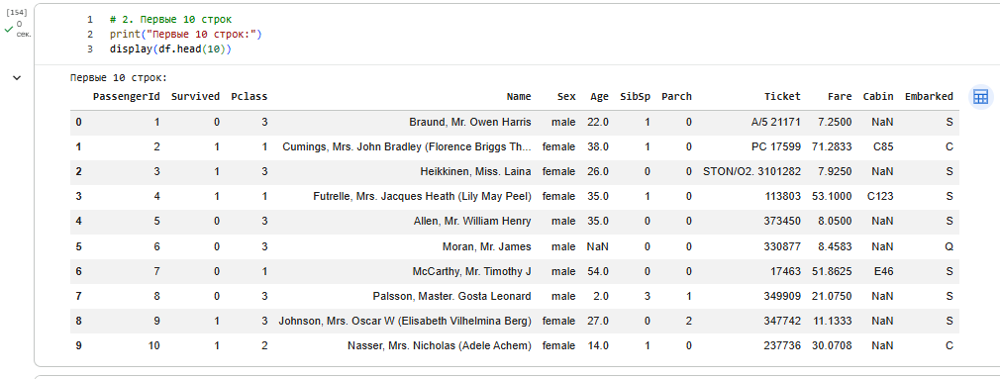
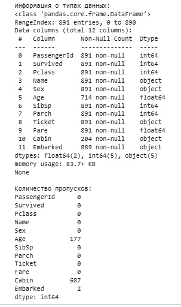

## 4. Первичный визуальный анализ
На начальном этапе был проведен осмотр данных. Выявлено, что данные неоднородны, содержат текстовые значения и множественные пропуски, препятствующие обучению алгоритмов.
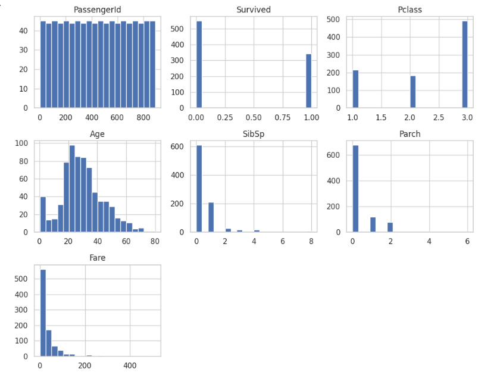

## 5. Расчет базовых статистик датафрейма
Метод `describe()` показал:
* Средний возраст до очистки составлял около 29.7 лет.
* Стоимость билета (`Fare`) имела сильный перекос вправо (максимальное значение 512 при медиане около 14).
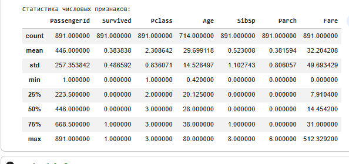

## 6. Анализ пропущенных значений
Подсчет `NaN` выявил три проблемные зоны:
* `Age` — около 20% пропущенных значений.
* `Cabin` — более 77% пропусков.
* `Embarked` — 2 пропущенных значения.

## 7. Стратегия обработки пропусков
* **Age:** Заполнен медианным значением по всему датасету (**28.0 лет**).
* **Embarked:** Заполнен самым часто встречающимся значением (модой) — портом **'S'** (Southampton).

## 8. Удаление неинформативных признаков
Из-за критического объема отсутствующих данных (>75%), столбец `Cabin` был полностью удален из датафрейма. Это решение позволило избежать искажений в моделях машинного обучения.

## 9. Анализ выбросов в числовых данных
С помощью графиков Boxplot были выявлены экстремальные значения в признаках возраста и стоимости билетов.
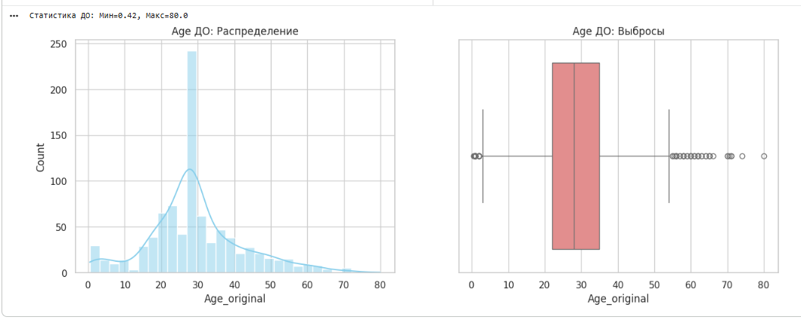
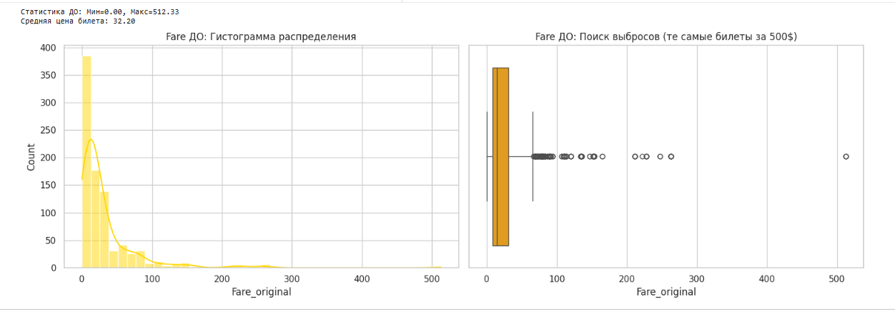

## 10. Применение винзоризации
Для устранения влияния аномалий была применена винзоризация. Выбросы за пределами 5-го и 95-го перцентилей были заменены на значения соответствующих перцентилей. Это сохранило объем данных, убрав экстремумы.

## 11. Оценка распределений после трансформации
После винзоризации максимальные значения `Age` и `Fare` стали статистически адекватными, перекос распределений существенно уменьшился.
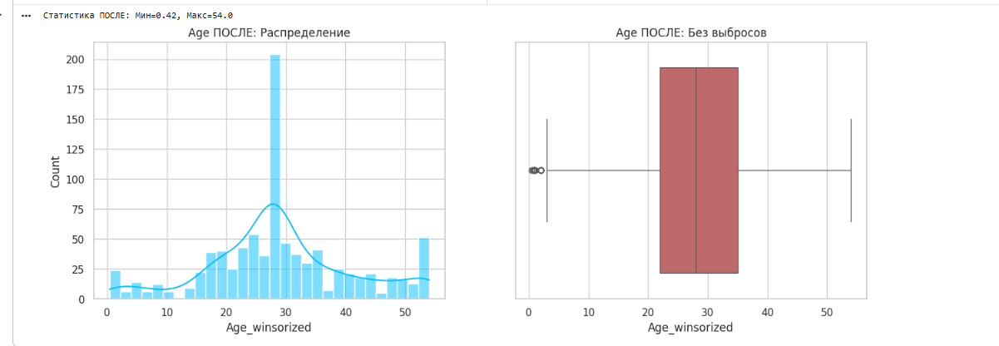
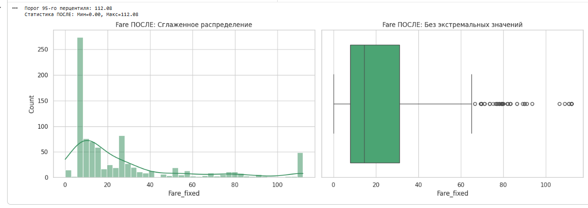

## 12. Конструирование новых признаков: Title
Из текстового поля `Name` с помощью регулярных выражений был извлечен титул пассажира (Mr, Mrs, Miss, Master и редкие титулы), что позволило получить скрытый социальный статус.
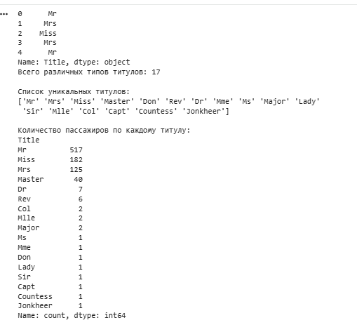

## 13. Конструирование новых признаков: FamilySize
Создан признак общего размера семьи пассажира по формуле: `FamilySize = SibSp + Parch + 1` (сам пассажир).

## 14. Конструирование новых признаков: IsAlone
На базе `FamilySize` создан бинарный признак одиночества. Если `FamilySize == 1`, пассажиру присваивался статус `IsAlone = 1`, иначе `0`.

## 15. Категоризация признаков: Pclass_cat
Числовой признак класса билета (`Pclass`: 1, 2, 3) был преобразован в строковую категорию `Pclass_cat` ('F' - First, 'S' - Second, 'T' - Third) для более наглядной агрегации.

## 16. Числовое кодирование: Sex
Для последующего расчета матрицы корреляции текстовые значения столбца `Sex` были закодированы бинарно: `male` - 0, `female` - 1.

## 17. Агрегация данных: Выживаемость по классам и портам
Была рассчитана средняя выживаемость по классам:
* F (1 класс): 62.9%
* S (2 класс): 47.2%
* T (3 класс): 24.2%
Медианный возраст по всем портам посадки после заполнения пропусков составил 28 лет.

## 18. Сводная таблица: Класс и Пол
Анализ показал колоссальный разрыв в выживаемости:
* Женщины 1-го класса: **96.8%**
* Мужчины 3-го класса: **13.5%**

## 19. Оценка влияния размера семьи на выживаемость
Установлено, что одинокие пассажиры выживали реже (30.3%), чем семейные (50.5%). Пик выживаемости (72.4%) приходился на семьи из 4 человек. Огромные семьи (8-11 человек) имели нулевую выживаемость.
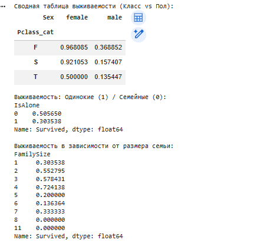

## 20. Корреляционный анализ признаков
Матрица корреляции подтвердила гипотезы:
* `Sex` (0.54) — сильнейшая прямая зависимость выживания (преимущество у женщин).
* `Pclass` (-0.34) — обратная зависимость (чем выше номер класса, тем ниже шансы).
* `IsAlone` (-0.20) — одиночество снижало шансы на спасение.
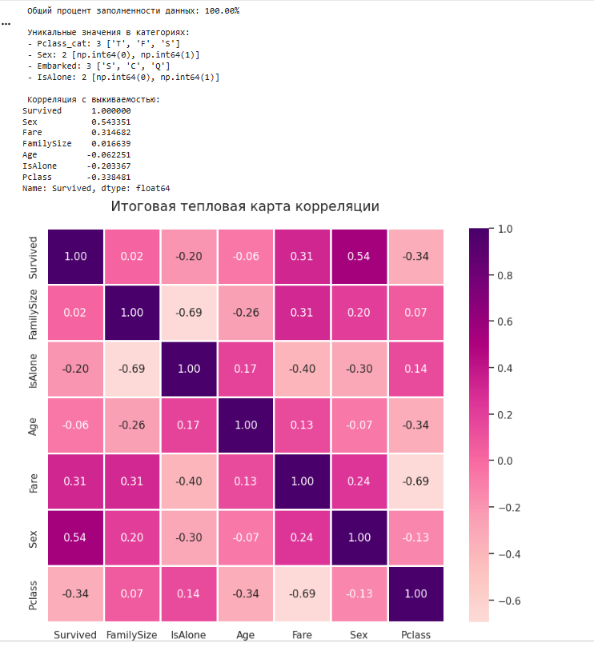

## 21. Итоговые выводы
1. Итоговый датасет содержит **100.00%** заполненных данных.
2. Проведенная трансформация (винзоризация) и удаление неинформативных признаков (`Cabin`) повысили качество датасета.
3. Новые признаки (`IsAlone`, `FamilySize`) оказались статистически значимыми.
4. Основными предикторами выживания на Титанике являлись пол и социальный статус (класс пассажира).
5. Набор данных `titanic_cleaned.csv` полностью готов к подаче на вход алгоритмам машинного обучения.