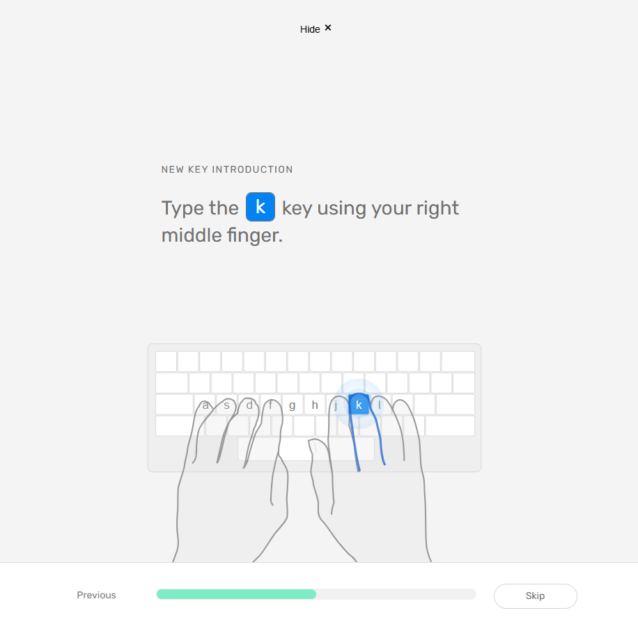
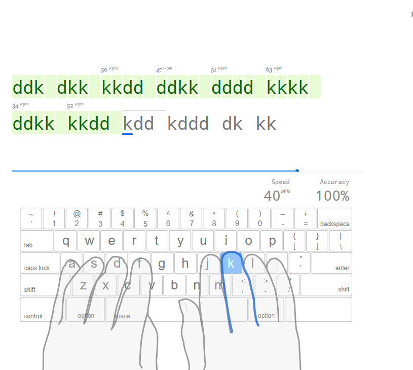
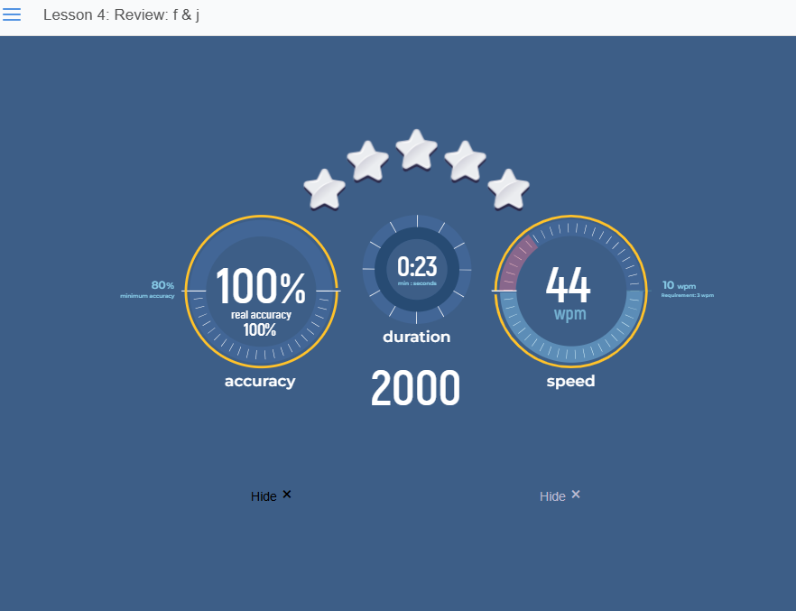
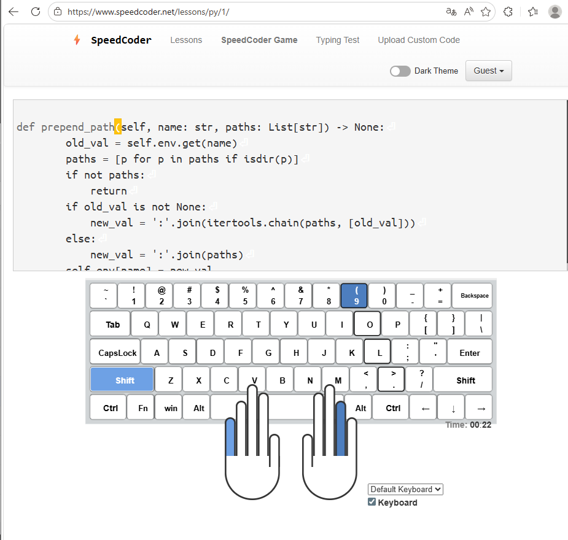
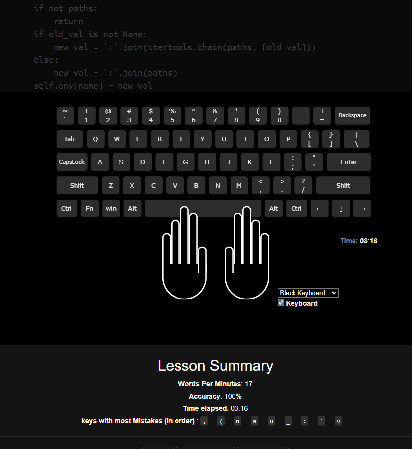
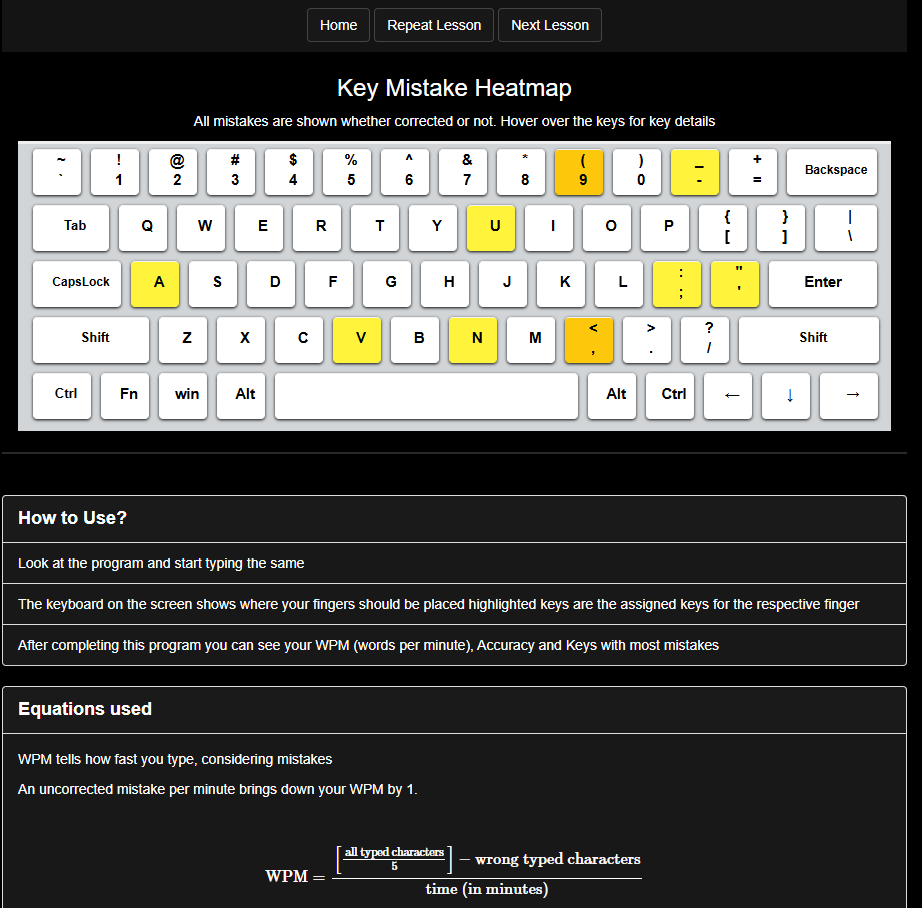
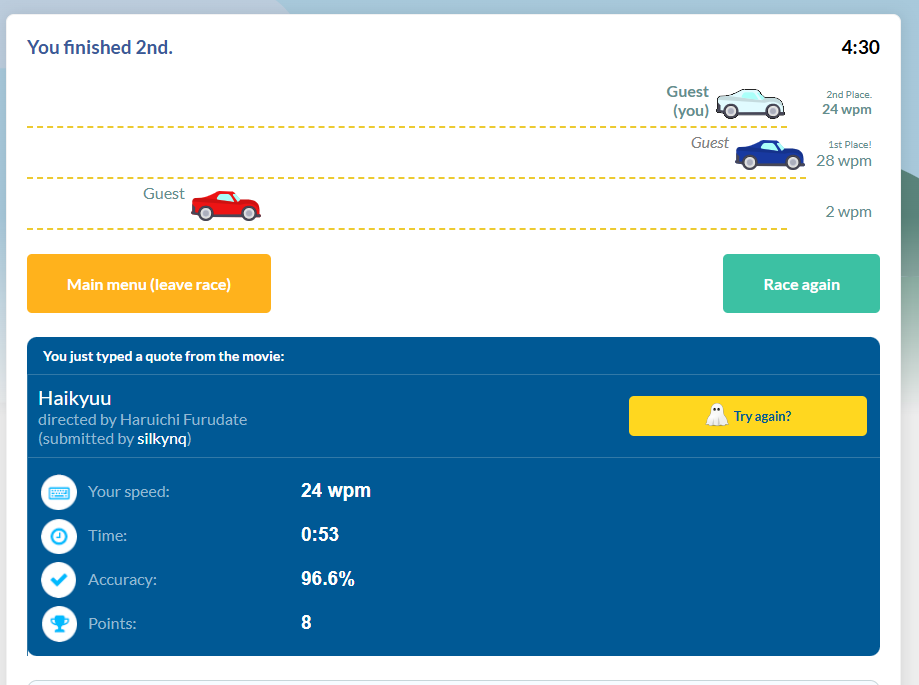
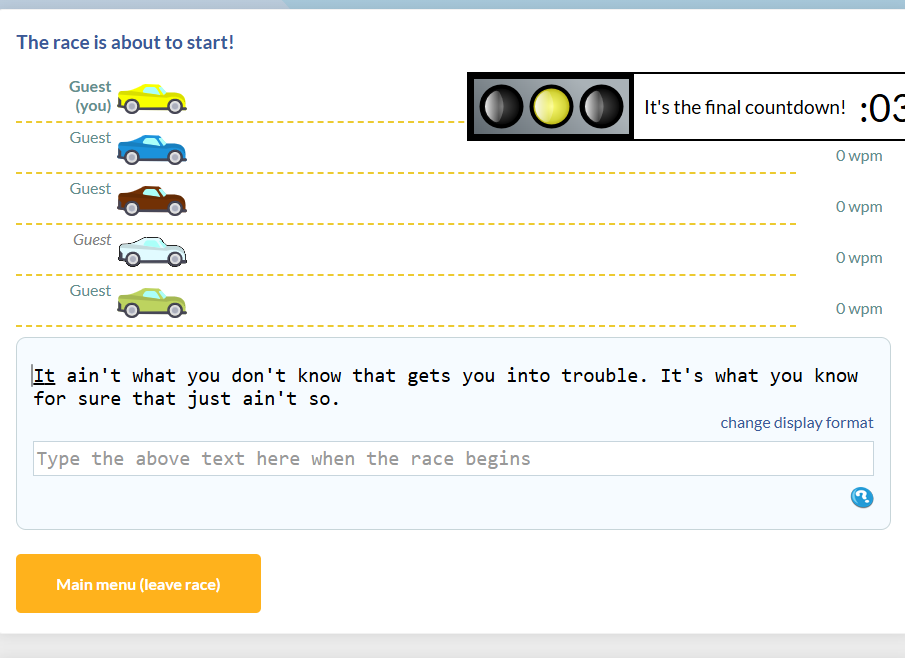
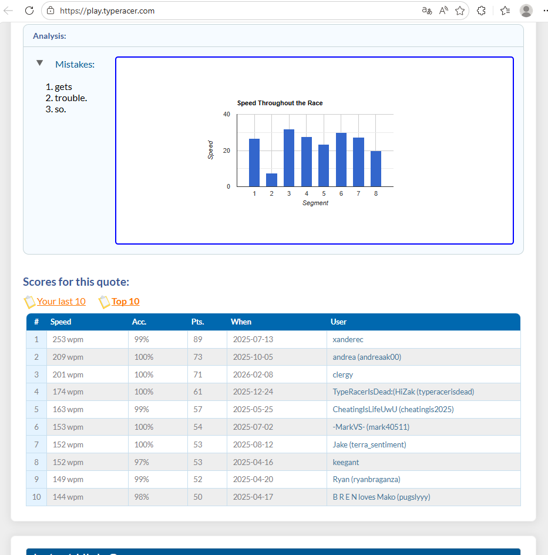

# Сайты, для практики слепой печати

## 1. [Typing club]( https://www.typingclub.com/)

## Тип: Интерактивный учебный курс

Один из лучших инструментов для новичков. Обучение разбито на сотни коротких игровых уровней. Основной упор сделан на правильную постановку пальцев: на экране отображается виртуальная клавиатура и руки, которые подсказывают, каким пальцем нажимать нужную клавишу. Полностью бесплатен и поддерживает русский язык. Есть видео-уроки. 

## 2. [Speed coder]( https://www.speedcoder.net/)

## Тип: Специализированный тренажер для программистов

Вместо обычных текстов здесь нужно печатать реальный программный код (Python, JavaScript, C++ и др.). Это помогает довести до автоматизма набор специфических символов Можно загружать свои файлы или тренироваться на open-source проектах.

## 3. [Type Racer]( https://play.typeracer.com/)

## Тип: Глобальная многопользовательская гонка.

Популярный во всем мире сервис, где вы соревнуетесь в скорости печати с реальными людьми. Вы управляете гоночным автомобилем, скорость которого зависит от темпа вашего набора. Есть система рангов, уровней и гараж с вашими достижениями. 

